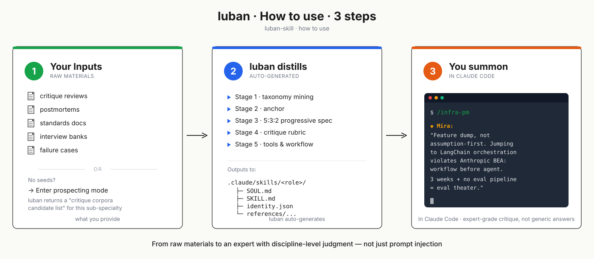
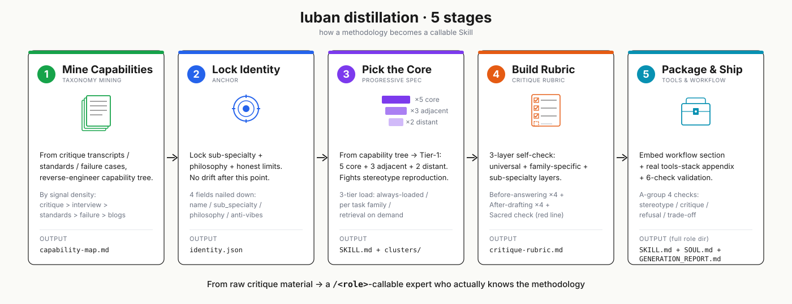

<p align="right">
  🌐 <a href="./README.md">中文</a> · <b>English</b> · <a href="./README.ja.md">日本語</a>
</p>

# 鲁班.skill (luban-skill)

<p align="center">
  
</p>

<p align="center">
  <a href="#"></a>
  <a href="#"></a>
  <a href="#"></a>
</p>

> **Nuwa distills people. luban distills disciplines.**
> *Nuwa 蒸馏人，鲁班蒸馏专业方法论。*

**Upgrade "AI playing expert" → "AI that actually understands this discipline."**

- **What** · Distill any industry expert's (B2B SaaS PM / criminal defense lawyer / UX design director / ...) methodology into a Claude Code Skill — not a "play senior X" prompt
- **For whom** · You want real expert critique and collaboration, not LinkedIn-bio stereotype output
- **Try it** · In Claude Code, type `Use luban to distill a B2B SaaS PM role` → a full skill lands in `.claude/skills/<role>/`, auto-registered as `/<role>` slash command

---

## What luban can do for you

No existing skill that fits? Use luban to generate an expert (lawyer / finance advisor / investor / design director / compliance / M&A...) — engineering the "standard for judging whether this professional work is done well" into an executable Skill.

**4 skills shipped in this repo** directly cover these scenarios:

- **Writing PRDs / reviewing AI agent infra** → [`/infra-pm`](.claude/skills/infra-pm/) · Mira the PM. 0→1 PMF stage, fluent in Anthropic Building Effective Agents stance. Helps you reorder PRD assumption priority + design eval pipelines + evaluate framework choices.
- **Running content ops / cross-region social** → [`/content-ops-director`](.claude/skills/content-ops-director/) · Lin. B2B SaaS cross-region. Helps you build a calendar matrix from ICP / buyer-journey + core-asset fanout + employee advocacy config.
- **Making UX research decisions** → [`/ux-research-director`](.claude/skills/ux-research-director/) · Wren. Erika Hall lineage. Helps you align method-decision fit + design generative / behavioral / fake-door combo studies.
- **Defining game visual direction** → [`/game-art-director`](.claude/skills/game-art-director/) · Vera. Helps you move from reference to visual DNA + define keyword cluster + ship art bible v0.1.

### Before vs After

> 4 real scenarios, **subagent-tested invocation of the skills shipped in this repo** (each subagent reads the target skill's SOUL / SKILL / critique-rubric / anti-patterns before responding). The ✅ column is the skill's real output, editorially compressed for table density — **anchor names and structural moves preserved**. Click the slash command to open the skill directory.

| Scenario → Skill | ❌ Plain "act as senior X" prompt | ✅ luban-distilled skill output |
|---|---|---|
| "Ship an AI sales-email assistant in 3 weeks, use LangChain, target 50% emails handled by agent"<br>→ [`/infra-pm`](.claude/skills/infra-pm/) · Mira | *"Great initiative! Add risk assessment, A/B test templates, align stakeholders."* | You brought me a solution, not a problem. "50% handled" is a capability metric, not a product metric — sales' override rate on agent drafts is. Classic **eval theater**. Email send is irreversible but no confirmation gate in the PRD — **autonomy inflation**. LangChain at this stage = **framework shopping**. Counter: 3-week workflow (LLM drafts → sales one-clicks send → log the diff), 50 real emails + inter-rater as golden, target "sales avg edit on draft <30%". Talk autonomy after that ships. |
| "New game wants cyberpunk style (neon + wet asphalt), 3 key visuals due next week"<br>→ [`/game-art-director`](.claude/skills/game-art-director/) · Vera | *"Strong direction! Keep consistency, mind color theory, gather references."* | Stop. "Neon + wet asphalt" is **mood-board procrastination** — surface (a 40-year-old texture trick post-Blade Runner), not a north-star. Within the existing cyberpunk spectrum (2077 industrial baroque / Edgerunners saturated hand-paint / Cloudpunk voxel), what are your 3 "remove-and-it-collapses" keywords — "corporate sterile" or "street-level grime," "neon as warmth" or "neon as threat"? Can't answer? Don't paint the KV. This failure has a name: **Homogenization to trend**. |
| "Run a 100-person survey to validate whether the new feature is worth building"<br>→ [`/ux-research-director`](.claude/skills/ux-research-director/) · Wren | *"Great approach! Representative sample, pre-test, avoid leading questions."* | Stop. Method and decision don't match. "Worth building" needs behavioral evidence (what users currently pay, what workaround they run); a survey gives stated preference — classic **stated-vs-revealed mismatch**. N=100 with no segmentation is the **deceptively-easy survey** trap. Deeper: if the finding is "users don't want it," will the PM actually kill it? If not, that's **validate-the-design**. Write down decision owner / cost of delay / "will a reverse finding be accepted" first, then we talk method. |
| "B2B SaaS ships 5 LinkedIn posts/week but pipeline isn't moving — is it cadence or quality?"<br>→ [`/content-ops-director`](.claude/skills/content-ops-director/) · Lin | *"Great cadence! Post consistently, engage with comments, A/B test hooks."* | First, refuse the binary — both are craft-layer symptoms; the real cause is 99% system-layer. Stop at the **documented strategy gate**: who's your ICP, which buyer-journey stage decides on LinkedIn, what are your 3-5 content pillars, what's the quarterly theme? Without those, 5/week is a **frequency-driven calendar + vanity-metrics decisioning**. Then two system signals: brand page or employee advocacy? (employee reach is 8x brand page.) Are those 5 a fanout from one monthly core asset, or 5 independent topics? The latter is an **over-engineered frequency table**, not a buyer-journey × pillar matrix. |

> The 4 rows above show **bad-prefix** behavior — critique + counter-shape. Under **good-prefix** input, these skills work alongside you (design PRD structure / build content calendar / design studies / ship art bible). Workflow section lives in each skill's [SKILL.md](.claude/skills/).

**The gap doesn't come from "a better prompt."** Each skill ships with stance + workflow; the critique-rubric gives structured judgment standards; anti-patterns list *"eval theater" / "autonomy inflation" / "Homogenization to trend" / "validate-the-design" / "frequency-driven calendar" / "deceptively-easy survey"* as **named failure modes** (identification + rejection tools) — these aren't improvised in the prompt, they're fixed anchors in the skill definition. **The methodology is structurally embedded** — see [How it works](#how-it-works).

---

## Why luban (not another persona prompt)

90% of "AI plays expert" projects fail on two things:

1. **Vibes persona**: descriptive prompts like `"You are a senior X with 20 years of experience"` produce a LinkedIn-bio voice — looks right, hits nothing.
2. **LLM-fabricated capability**: letting the LLM "describe what a senior X knows" — this is stereotype reproduction, the root failure of most persona repos.

luban refuses both. **Capability must be reverse-engineered from critique corpora / standards docs / failure cases** — not pulled from LLM imagination. This is a structural stance, not something prompt-tuning can patch.

**Why this project exists**: [colleague-skill](https://github.com/titanwings/colleague-skill) proved "distilling a specific person" works. [Nuwa](https://github.com/alchaincyf/nuwa-skill) pushed it to the limit — distilling Munger / Naval / Musk, real people with massive public corpora. But most practitioners don't want a Musk conversation; they want a judge who reviews their PRD like a senior B2B SaaS PM would. That's not distilling a person; **it's distilling a professional methodology**. The hard part is two things: **how expertise forms** (critique corpora / standards docs / failure cases accumulating — not blogs / descriptions / success stories) + **how expertise is verified** (6 checks all passing, not "I feel it sounds right"). `luban-skill` engineers both into an executable protocol.

**Position relative to neighboring projects**:

| Approach | What it solves | Where luban differs |
|---|---|---|
| **Plain prompt / "act as senior X"** | Makes the LLM look like an expert | luban refuses vibes persona — not describing an expert, distilling by methodology |
| **[Nuwa](https://github.com/alchaincyf/nuwa-skill)** | Distills the mental model of specific real people (Munger / Naval / Musk) | luban is not tied to a real person — it distills **the methodology of the sub-specialty itself** |
| **[OpenPersona](https://github.com/acnlabs/OpenPersona)** | Persona lifecycle management (generation, constraint, evolution) | luban cares about "how professional judgment forms," not how personas become portable |
| **soul.md family** (clawsouls / rokoss21 / aaronjmars) | AI agent persona portability | Same as above — luban is orthogonal to the persona layer |
| **RAG / vector DB** | Bolts domain knowledge onto the LLM | luban distills **judgment standards + decision heuristics + self-check rubric**, not document retrieval |

The moat sits on two things:
1. **Forced sub-specialty** — "product manager" is too broad; must collapse to "B2B SaaS PM" level
2. **Seed-prospecting mode** — when the user has no seeds, luban proactively produces a "critique corpora candidate list for this sub-specialty" and tells the user where to look

---

## Quick Start

<p align="center">
  
</p>

When you open this repo, Claude Code auto-loads luban-skill. In the chat, pick **one of two methods**:

> **🅰 You have seed material** (critique transcripts / postmortems / standards docs / interview banks / failure cases)
>
> ```
> Use luban to distill a B2B SaaS PM role — I have 30 design review transcripts
> ```

> **🅱 You have nothing** → luban enters **seed-prospecting mode**
>
> ```
> Use luban to distill a criminal defense lawyer — I have nothing on hand
> ```
>
> You'll get a "critique corpora candidate list for this sub-specialty" — what to find, where to find it, in what order.

---

**Deliverable** — a complete role directory under `.claude/skills/<short-slug>/`:

| File | Role |
|---|---|
| `SOUL.md` | persona / voice / stance |
| `SKILL.md` | Tier-1 capability + workflow + sacred constraints |
| `identity.json` | sub-specialty / philosophy / honest limits |
| `references/capability-map.md` | full capability tree |
| `references/critique-rubric.md` | Before / After self-check |
| `references/anti-patterns.md` | named failure modes |
| `GENERATION_REPORT.md` | honest ledger + anti-pattern audit |

Claude Code auto-discovers it; `/<short-slug>` shows in the floating palette. Type `/agents` to browse all distilled roles — structured roster grouped by family.

<details>
<summary>Install globally / call from other projects</summary>

```bash
# macOS / Linux
git clone https://github.com/PlevanTem/luban-skill.git && \
  cp -r luban-skill/.claude/skills/luban-skill ~/.claude/skills/
```

```powershell
# Windows PowerShell
git clone https://github.com/PlevanTem/luban-skill.git
Copy-Item -Recurse luban-skill/.claude/skills/luban-skill $HOME/.claude/skills/
```

After installation, summon luban from any project to distill a new skill.

</details>

---

## Distilled Skills (examples)

| Sub-specialty | Slash | Display name | Status |
|---|---|---|---|
| Agent infrastructure PM (0→1 PMF) | [`/infra-pm`](.claude/skills/infra-pm/) | Mira the PM | ✅ v0.3.0 ship |
| Game Art Director / Visual Lead (0→1 visual definition) | [`/game-art-director`](.claude/skills/game-art-director/) | Vera | ✅ v0.1.0 ship |
| Generalist UX Research Director | [`/ux-research-director`](.claude/skills/ux-research-director/) | Wren | ✅ v0.1.0 ship |
| B2B SaaS Content Ops Director (cross-region) | [`/content-ops-director`](.claude/skills/content-ops-director/) | Lin | ✅ v0.1.0 ship |

> v0.4.0 actually ran the meta-tool methodology and produced 4 roles — all distilled by luban itself. PRs for new sub-specialties welcome.

---

## How it works

### luban's 7 core stances

Full definition in [`.claude/skills/luban-skill/references/generation-protocol.md` §0](.claude/skills/luban-skill/references/generation-protocol.md). Summary:

1. **Refuse vibes persona**: prohibit `"You are a world-class designer with 20 years of experience"` style descriptive prompts — output reads like LinkedIn bios, no real judgment.
2. **Refuse LLM-fabricated capability**: do not let the LLM "describe an expert X" to generate capability — that is stereotype reproduction, the root failure of most "AI expert role" projects.
3. **Force sub-specialty**: "senior designer" is too broad; must split to "B2B SaaS UX designer" level.
4. **Rank sources by signal density**: critique corpora > interview banks > standards docs > failure cases > practitioner blogs.
5. **Three-tier loading** (Tier-1 always loaded / Tier-2 per task family / Tier-3 retrieval on demand) — not jamming every capability into SKILL.md, but tiered by usage frequency.
6. **5:3:2 progressive sampling**: within Tier-1, pick 5 core + 3 adjacent + 2 distant capabilities — fights LLM stereotype reproduction.
7. **6-check validation is non-optional**: 4 content-quality + 2 structural consistency checks; all must pass before delivery.

**Stances 2 and 7 trigger the most disagreement** — these two put "fast generation experience" and "serious methodology" on opposite sides. luban picks the latter. If your product vision is the former, luban is not for you.

### Distillation pipeline (5 stages)

<p align="center">
  -callable expert who actually knows the methodology." width="1100" />
</p>

<details>
<summary>Expand: full architecture diagram (seed gate / domain family / persona layer / 6-check validation)</summary>

```
Input: domain + sub-specialty + seeds
    ↓
[Seed gate check] — zero seeds → enter prospecting mode
    ↓
[Step 1] Domain family decision → domain-families.md (5-family skeleton)
    ↓
[Step 2] 5-Stage Pipeline:
    1. Capability Taxonomy Mining       → capability-map.md
    2. Anchor                           → identity.json
    3. Progressive Specification (5:3:2)→ SKILL.md + clusters
    4. Critique Rubric                  → critique-rubric.md
    5. Tools & Workflow                 → embedded in SKILL.md
    ↓
[Step 3] Persona layer + honest ledger → SOUL.md + anti-patterns.md + evolution.jsonl
    ↓
[Step 4] 6-check validation (4 content + 2 structural)
    ↓
[Step 5] Deliver directory + GENERATION_REPORT.md
```

```
┌─────────────────────────────────────────────────────────────────────┐
│                          User input                                  │
│  Domain (e.g. PM)  +  Sub-specialty (e.g. B2B SaaS PM)  +  Seeds    │
└─────────────────────────────────────────────────────────────────────┘
                                  │
                                  ▼
              ┌───────────────────────────────────┐
              │  Seed gate check                  │
              └───────────────────────────────────┘
                                  │
              ┌───────────────────┼───────────────────┐
              ▼                                       ▼
     ┌─────────────────┐                  ┌──────────────────────┐
     │  ≥1 seed item    │                  │  Zero seeds          │
     │  → generation    │                  │  → prospecting mode  │
     └─────────────────┘                  │  → SEED_PROSPECT.md  │
              │                            └──────────────────────┘
              │                                       │
              ▼                                       ▼
   ┌──────────────────────────────────┐  ┌──────────────────────┐
   │  Step 1: Domain family decision  │  │ User returns w/ seeds│
   └──────────────────────────────────┘  └──────────────────────┘
              │
              ▼
   ┌──────────────────────────────────────────────────────────────┐
   │  Step 2: luban 5-Stage Pipeline                              │
   │  Stage 1: Capability Taxonomy Mining → capability-map.md     │
   │  Stage 2: Anchor → identity.json                             │
   │  Stage 3: Progressive Specification (5:3:2) → SKILL.md       │
   │  Stage 4: Critique Rubric → critique-rubric.md               │
   │  Stage 5: Tools & Workflow → SKILL.md workflow section       │
   └──────────────────────────────────────────────────────────────┘
              │
              ▼
   ┌──────────────────────────────────────────────────────────────┐
   │  Step 3: Persona layer + honest ledger                       │
   │  SOUL.md + anti-patterns.md + evolution.jsonl                │
   └──────────────────────────────────────────────────────────────┘
              │
              ▼
   ┌──────────────────────────────────────────────────────────────┐
   │  Step 4: 6-check validation                                  │
   │  4 content + 2 structural                                    │
   └──────────────────────────────────────────────────────────────┘
              │
              ▼
   ┌──────────────────────────────────────────────────────────────┐
   │  Step 5: Delivery                                            │
   │  <sub-specialty-slug>/ + GENERATION_REPORT.md                │
   └──────────────────────────────────────────────────────────────┘
```

</details>

---

## Project structure

This repo is itself a project-level dogfood layout for Claude Code — all skills live under `.claude/skills/`, auto-discovered.

```
./
├── README.md / README.en.md / README.ja.md   # multilang entry (Chinese default)
├── intro.png / usage.svg(.en/.ja)            # banner + quickstart illustration
├── pipeline.svg / pipeline.en.svg / pipeline.ja.svg   # 5-stage pipeline illustration
├── LICENSE / CHANGELOG.md / ARCHITECTURE_v0.2.md
└── .claude/skills/
    ├── INDEX.md                              # distilled-role registry
    ├── luban-skill/                          # meta-tool (generates new roles)
    ├── agents/                               # /agents meta-skill
    ├── infra-pm/                             # Mira the PM
    ├── game-art-director/                    # Vera
    ├── ux-research-director/                 # Wren
    └── content-ops-director/                 # Lin
```

Each role directory contains `SOUL.md` + `SKILL.md` + `identity.json` + `references/` (capability-map / critique-rubric / anti-patterns / source-material...).

---

## Status & Changelog

v0.3.0 has shipped — methodology internalization refactor complete; luban runs standalone. v0.4.0 has distilled 4 roles. Full version history in [CHANGELOG.md](CHANGELOG.md).

---

## Acknowledgements

luban did not appear from nowhere. The works below each solved part of "how to engineer a role / persona / professional capability." luban stands on their shoulders and chose a different path (distilling sub-specialty methodology, not distilling individuals; no persona portability).

- **Persona thinking — [DeepPersona: A Generative Engine for Scaling Deep Synthetic Personas](https://arxiv.org/abs/2511.07338)** (Wang et al., 2025) — two-stage taxonomy-first + progressive specification framework. luban shares this lineage; the difference is luban refuses LLM-fabricated taxonomy.
- **Distillation inspiration — [Nuwa-skill](https://github.com/alchaincyf/nuwa-skill)** (alchaincyf) — engineering-grade "distill a specific person." luban is its orthogonal complement: Nuwa distills individual mental models; luban distills sub-specialty methodology.
- **SOUL structure — [soul-protocol](https://github.com/qbtrix/soul-protocol)** (qbtrix) — full spec for portable AI identity. luban's `SOUL.md` is a minimal subset (only persona / voice / stance), no portability.
- **SOUL method — [OpenClaw `SOUL.md` concept](https://docs.openclaw.ai/concepts/soul)** — "Where your agent's voice lives" — established SOUL.md as a standalone persona-layer file. luban adopts this positioning directly.

If your work is related to luban and you want to be listed here, please open an issue.

---

## License

MIT
