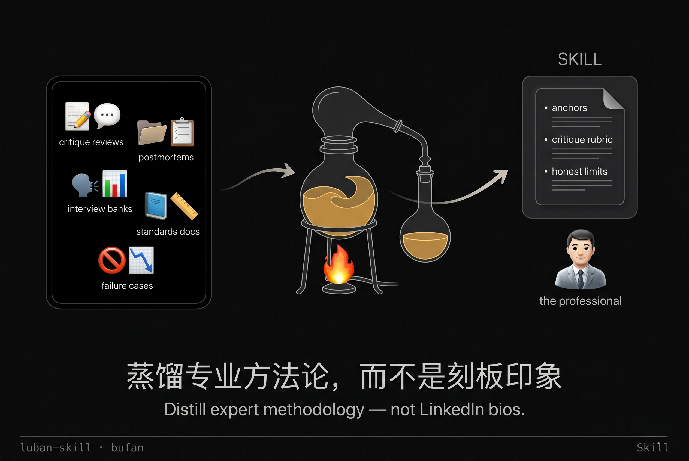
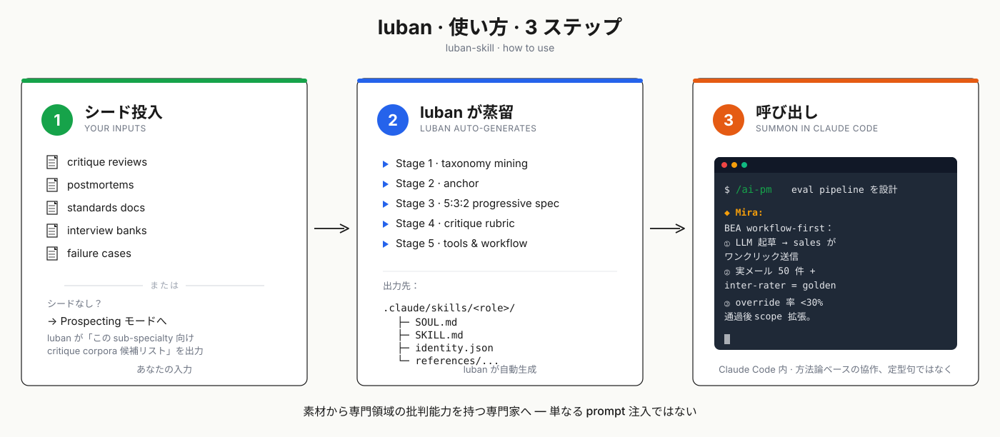
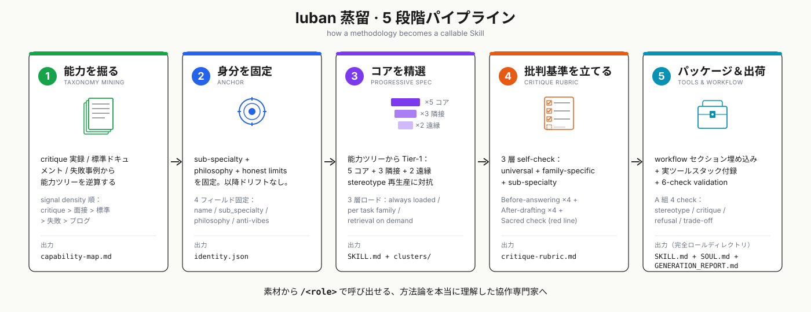

<p align="right">
  🌐 <a href="./README.md">中文</a> · <a href="./README.en.md">English</a> · <b>日本語</b>
</p>

# 鲁班.skill (luban-skill)

<p align="center">
  
</p>

<p align="center">
  <a href="#"></a>
  <a href="#"></a>
  <a href="#"></a>
</p>

> **Nuwa は人を蒸留する。luban は専門領域を蒸留する。**
> *Nuwa distills people. luban distills disciplines.*

**「AI が専門家を演じる」を「AI が本当にこの専門領域を理解する」へアップグレード。**

- **これは何か** · 業界の専門家（B2B SaaS PM / 刑事弁護士 / UX デザインディレクター / ...）の方法論を Claude Code Skill に蒸留する。「シニア X を演じる」prompt ではない
- **誰のためか** · LinkedIn-bio 風の定型句ではなく、本物の専門家の批判と協同が欲しい人
- **試し方** · Claude Code で `luban を使って B2B SaaS PM のロールを蒸留してください` と入力 → 完全な skill が `.claude/skills/<role>/` に生成され、`/<role>` slash コマンドとして自動登録

---

## luban で何ができるか

合うスキルがない？luban で専門家を生成する（弁護士 / 財務アドバイザー / 投資家 / デザインディレクター / コンプライアンス / M&A...）— 「その専門の仕事が良くなされているかを判断する基準」を実行可能な Skill にエンジニアリングする。

**本リポジトリで ship 済の 4 skill** が以下のシナリオを直接カバー：

- **PRD を書く / AI agent インフラのレビュー** → [`/infra-pm`](.claude/skills/infra-pm/) · Mira the PM。0→1 PMF 段階、Anthropic Building Effective Agents スタンスに精通。PRD の assumption 順序を再整理 + eval pipeline を設計 + framework 選択を評価。
- **コンテンツ運営 / 国内外 SNS 編成** → [`/content-ops-director`](.claude/skills/content-ops-director/) · Lin。B2B SaaS クロスリージョン。ICP / buyer journey から calendar マトリクス + core-asset fanout + employee advocacy 構成を組み立てる。
- **UX 調査の意思決定** → [`/ux-research-director`](.claude/skills/ux-research-director/) · Wren。Erika Hall ライン。method-decision fit を整える + generative / behavioral / fake-door の組み合わせ調査を設計。
- **ゲーム視覚方向の定義** → [`/game-art-director`](.claude/skills/game-art-director/) · Vera。reference から visual DNA へ + keyword cluster を確定 + art bible v0.1 を ship。

### Before / After 比較

> 4 つの実シナリオ、**本リポジトリで ship 済の skill を subagent で実測呼び出し**（各 subagent は対応 skill の SOUL / SKILL / critique-rubric / anti-patterns を読んでから応答）。✅ 列は skill の実出力で、テーブル密度のために editorial 圧縮あり — **anchor 命名と構造的 move は原型を保持**。slash コマンドのクリックで skill ディレクトリへ。

| シナリオ → Skill | ❌ 「シニア X を演じる」普通の prompt | ✅ luban 蒸留 skill 実測 |
|---|---|---|
| 「3 週間で AI セールスメールアシスタントをリリース、LangChain で、目標は 50% を agent が自動処理」<br>→ [`/infra-pm`](.claude/skills/infra-pm/) · Mira | *"Great initiative! Add risk assessment, A/B test templates, align stakeholders."* | 持ち込んでいるのは解決策で、問題ではない。「50% 自動処理」は capability metric であって product metric ではない — sales が agent ドラフトを override する率こそ。典型的な **eval theater**。メール送信は不可逆だが PRD に confirmation gate がない — **autonomy インフレ**。この段階で LangChain は **framework shopping**。逆提案：3 週間で workflow を作る（LLM 起草 → sales ワンクリック送信 → diff をログ）、実メール 50 件 + inter-rater を golden、目標を「sales の平均修正量 <30%」に変える。動いてから autonomy を語る。 |
| 「新ゲームを cyberpunk 風に（ネオン + 濡れた路面の反射）、来週 3 枚の KV を納品」<br>→ [`/game-art-director`](.claude/skills/game-art-director/) · Vera | *"Strong direction! Keep consistency, mind color theory, gather references."* | 停止。「ネオン + 濡れた路面」は **mood-board procrastination** — Blade Runner 以降 40 年使い回された texture trick で、north-star ではない。既存 cyberpunk スペクトル（2077 工業バロック / Edgerunners 高彩度手描き / Cloudpunk ボクセル）の中で、君たちの「削れば成立しない」3 つの keyword は何か — "corporate sterile" か "street-level grime" か、"neon as warmth" か "neon as threat" か？答えられないなら KV を描き始めるな。この失敗には名前がある：**Homogenization to trend**。 |
| 「100 人アンケートで新機能の投資価値を検証」<br>→ [`/ux-research-director`](.claude/skills/ux-research-director/) · Wren | *"Great approach! Representative sample, pre-test, avoid leading questions."* | 停止。method と decision が噛み合っていない。「投資に値するか」は behavioral evidence が必要（ユーザーが今払っているコスト、回している workaround）。survey が返すのは stated preference — 古典的な **stated-vs-revealed 不一致**。N=100 で segmentation なしは **deceptively-easy survey** の罠。さらに：finding が「ユーザーは要らない」と出たら、PM は本当にキルするのか？しないなら **validate-the-design**。decision owner / 判断遅延のコスト /「逆 finding が受け入れられるか」を先に書き出してから方法を話す。 |
| 「B2B SaaS で週 5 本 LinkedIn 投稿しているが pipeline が動かない — cadence 不足か質か？」<br>→ [`/content-ops-director`](.claude/skills/content-ops-director/) · Lin | *"Great cadence! Post consistently, engage with comments, A/B test hooks."* | まず二択を却下する — 両方 craft 層の症状、真因は 99% system 層。**documented strategy gate** で停まる：ICP は誰、buyer journey のどの段階で LinkedIn が決定するのか、3-5 の content pillar、四半期テーマ — 答えられないなら週 5 本は **frequency-driven calendar + vanity-metrics 意思決定**。次に system シグナルを 2 つ：brand page か employee advocacy か？（employee reach は brand page の 8 倍）5 本は 1 つの monthly core asset の fanout か、5 つの独立トピックか？後者は **over-engineered frequency table** で、buyer-journey × pillar マトリクスではない。 |

> 上記 4 行が示すのは **悪い前提下** での skills の反応 — critique + 逆提案。**良い前提下** では一緒に作業する（PRD 構造を設計 / content calendar を組む / 調査を設計 / art bible を ship）。workflow セクションは各 skill の [SKILL.md](.claude/skills/) を参照。

**差は「より良い prompt」から来ているのではない** — 各 skill は stance + workflow を内蔵し、critique-rubric が構造化された判断基準を与え、anti-patterns が *"eval theater" / "autonomy インフレ" / "Homogenization to trend" / "validate-the-design" / "frequency-driven calendar" / "deceptively-easy survey"* を **具名失敗モード**（識別 + 悪い案を退ける道具）として列挙する — prompt で即興されたものではなく、skill 定義に焼き込まれた anchor。**方法論は構造的に埋め込まれている** — 詳細は [How it works](#how-it-works) を参照。

---

## Why luban (not another persona prompt)

世の中の「AI が専門家を演じる」プロジェクトの 90% は、以下の 2 点でつまずく：

1. **Vibes persona**：`"You are a senior X with 20 years of experience"` のような記述的 prompt は LinkedIn-bio 風の voice を生み、それっぽいが本質を捉えない。
2. **LLM による空想 capability 生成**：LLM 自身に「シニア X が知っていることを記述させる」 — これは stereotype の再生産であり、大半の persona repo の根本的失敗。

luban はこの両方を拒否する。**Capability は critique corpora / 標準ドキュメント / 失敗事例から逆算されなければならず**、LLM の想像から引き出してはいけない。これは構造的スタンスであり、prompt チューニングでは補えない。

**なぜこのプロジェクトを作るか**：[colleague-skill](https://github.com/titanwings/colleague-skill) は「特定の人を蒸留する」が可能であることを示した。[Nuwa](https://github.com/alchaincyf/nuwa-skill) はそれを極限まで押し進めた — Munger / Naval / Musk のような大量の公開コーパスを持つ実在人物を蒸留する。しかし大半の専門家が直面しているのは「Musk とオンライン対話したい」ではなく、「シニア B2B SaaS PM のように私の PRD を審査してくれる判断者が欲しい」だ。これは人の蒸留ではなく、**専門方法論の蒸留**である。難しさは 2 つ：**専門性がどう形成されるか**（critique corpora / 標準ドキュメント / 失敗事例の蓄積、ブログ / 記述 / 成功談ではなく）+ **専門性がどう検証されるか**（6 つの check 全通過によって、「正しそうだと感じる」ではなく）。`luban-skill` はこの 2 点を実行可能な protocol にエンジニアリングしている。

**近隣プロジェクトとの位置関係**：

| アプローチ | 解決するもの | luban の違い |
|---|---|---|
| **普通の prompt /「シニア X を演じる」** | LLM を専門家っぽく見せる | luban は vibes persona を拒否 — 専門家を記述するのではなく、方法論で蒸留する |
| **[Nuwa](https://github.com/alchaincyf/nuwa-skill)** | 具体的な実在人物 (Munger / Naval / Musk) の mental model を蒸留 | luban は実在人物に紐付かず、**その sub-specialty の方法論そのもの**を蒸留する |
| **[OpenPersona](https://github.com/acnlabs/OpenPersona)** | ペルソナのライフサイクル管理（生成・制約・進化） | luban の関心は「専門的判断がどう形成されるか」であり、ペルソナの portability ではない |
| **soul.md 系列** (clawsouls / rokoss21 / aaronjmars) | AI agent ペルソナの portability | 同上 — luban はペルソナ層に対して直交する |
| **RAG / ベクトル DB** | LLM に領域知識を外付けする | luban が蒸留するのは **判断基準 + 意思決定ヒューリスティック + 自己点検 rubric** であり、ドキュメント検索ではない |

護城河（差別化）は 2 点：
1. **Sub-specialty の強制** — 「プロダクトマネージャー」のような汎入力は不可。「B2B SaaS PM」レベルまで絞り込む
2. **シード prospecting モード** — ユーザーにシードがない場合、luban は「この sub-specialty 向け critique corpora 候補リスト」を能動的に出力し、ユーザーに探させる

---

## クイックスタート

<p align="center">
  
</p>

このリポジトリを開けば Claude Code が自動的に luban-skill をロードする。対話欄で **2 つの方法のいずれか** を選ぶ：

> **🅰 シード素材がある場合**（critique 実録 / postmortems / 標準ドキュメント / 面接題庫 / 失敗事例）
>
> ```
> luban を使って B2B SaaS PM のロールを蒸留してください。30 件の design review 実録を持っています。
> ```

> **🅱 何もない場合** → luban が **シード prospecting モード** に入る
>
> ```
> luban で刑事弁護士を蒸留したい。手元には何もない。
> ```
>
> 「この sub-specialty 向け critique corpora 候補リスト」を返す — 何を、どこで、どの順で探すかを教える。

---

**成果物** — 完全なロールディレクトリが `.claude/skills/<short-slug>/` に作成される：

| ファイル | 役割 |
|---|---|
| `SOUL.md` | ペルソナ / voice / stance |
| `SKILL.md` | Tier-1 capability + workflow + sacred constraints |
| `identity.json` | sub-specialty / philosophy / honest limits |
| `references/capability-map.md` | 完全な capability tree |
| `references/critique-rubric.md` | Before / After self-check |
| `references/anti-patterns.md` | 具名失敗モード |
| `GENERATION_REPORT.md` | 正直台帳 + anti-pattern audit |

Claude Code が自動発見し、`/<short-slug>` がフローティングパネルに表示される。`/agents` と入力すれば蒸留済みの全ロールを閲覧できる — 構造化された roster が family ごとにグループ化されてレンダリングされる。

<details>
<summary>グローバルインストール / 他プロジェクトから呼び出す</summary>

```bash
# macOS / Linux
git clone https://github.com/PlevanTem/luban-skill.git && \
  cp -r luban-skill/.claude/skills/luban-skill ~/.claude/skills/
```

```powershell
# Windows PowerShell
git clone https://github.com/PlevanTem/luban-skill.git
Copy-Item -Recurse luban-skill/.claude/skills/luban-skill $HOME/.claude/skills/
```

インストール後、どのプロジェクトからでも luban を呼び出して新しい skill を蒸留できる。

</details>

---

## 蒸留済み Skill の例

| Sub-specialty | Slash | 表示名 | 状態 |
|---|---|---|---|
| Agent infrastructure PM (0→1 PMF) | [`/infra-pm`](.claude/skills/infra-pm/) | Mira the PM | ✅ v0.3.0 ship |
| Game Art Director / Visual Lead (0→1 ビジュアル定調) | [`/game-art-director`](.claude/skills/game-art-director/) | Vera | ✅ v0.1.0 ship |
| Generalist UX Research Director | [`/ux-research-director`](.claude/skills/ux-research-director/) | Wren | ✅ v0.1.0 ship |
| B2B SaaS Content Ops Director (cross-region) | [`/content-ops-director`](.claude/skills/content-ops-director/) | Lin | ✅ v0.1.0 ship |

> v0.4.0 はメタツール方法論を実際に走らせ、4 つのロールを輩出した — すべて luban 自身で蒸留されている。新しい sub-specialty の PR を歓迎する。

---

## How it works

### luban の 7 つのコアスタンス

完全定義は [`.claude/skills/luban-skill/references/generation-protocol.md` §0](.claude/skills/luban-skill/references/generation-protocol.md) にある。要約：

1. **Vibes persona を拒否**：`"You are a world-class designer with 20 years of experience"` のような記述的 prompt を禁止 — 出力は LinkedIn-bio 風で、真の判断がない。
2. **LLM の空想生成を拒否**：LLM に「expert X を記述させる」ことで capability を生成するのは禁止 — これは stereotype の再生産であり、大半の「AI 専門家ロール」プロジェクトの根本的失敗。
3. **Sub-specialty を強制**：「senior designer」は広すぎ。「B2B SaaS UX designer」レベルまで分解する。
4. **データソースを signal density で順序付け**：critique corpora > interview banks > standards docs > failure cases > practitioner blogs。
5. **3 層ロード**（Tier-1 always loaded / Tier-2 per task family / Tier-3 retrieval on demand）— すべての能力を SKILL.md に詰め込むのではなく、使用頻度で階層化。
6. **5:3:2 progressive sampling**：Tier-1 内部で 5 コア + 3 隣接 + 2 遠縁の能力を選ぶ — LLM の stereotype 再生産に対抗する。
7. **6-check validation は非オプション**：内容品質 4 + 構造一貫性 2、全通過で初めて納品。

**最も意見が分かれるのはスタンス 2 と 7** — この 2 つは「高速生成体験」と「真剣な方法論」を対立軸に置く。luban は後者を選ぶ。あなたのプロダクトビジョンが前者なら、luban は向きません。

### 蒸留パイプライン（5 段階）

<p align="center">
   で呼び出せる、方法論を本当に理解した協作専門家へ。" width="1100" />
</p>

<details>
<summary>完全アーキテクチャ図を展開（シード門閾チェック / 領域 family 判定 / ペルソナ層 / 6-check validation）</summary>

```
入力：領域 + sub-specialty + シード
    ↓
[シード門閾チェック] — ゼロシードなら prospecting モードへ
    ↓
[Step 1] 領域 family 判定 → domain-families.md (5 family 骨格)
    ↓
[Step 2] 5 段階パイプライン：
    1. Capability Taxonomy Mining       → capability-map.md
    2. Anchor                           → identity.json
    3. Progressive Specification (5:3:2)→ SKILL.md + clusters
    4. Critique Rubric                  → critique-rubric.md
    5. Tools & Workflow                 → SKILL.md に埋め込み
    ↓
[Step 3] ペルソナ層 + 正直台帳 → SOUL.md + anti-patterns.md + evolution.jsonl
    ↓
[Step 4] 6-check validation（内容 4 + 構造 2）
    ↓
[Step 5] ディレクトリ納品 + GENERATION_REPORT.md
```

```
┌─────────────────────────────────────────────────────────────────────┐
│                          ユーザー入力                                 │
│  領域 (例：PM)  +  Sub-specialty (例：B2B SaaS PM)  +  シード素材    │
└─────────────────────────────────────────────────────────────────────┘
                                  │
                                  ▼
              ┌───────────────────────────────────┐
              │  シード門閾チェック                  │
              └───────────────────────────────────┘
                                  │
              ┌───────────────────┼───────────────────┐
              ▼                                       ▼
     ┌─────────────────┐                  ┌──────────────────────┐
     │  ≥1 件のシード   │                  │  ゼロシード           │
     │  → 生成フローへ  │                  │  → prospecting モード │
     └─────────────────┘                  │  → SEED_PROSPECT.md  │
              │                            └──────────────────────┘
              │                                       │
              ▼                                       ▼
   ┌──────────────────────────────────┐  ┌──────────────────────┐
   │  Step 1: 領域 family 判定         │  │ シードを携えて戻る    │
   └──────────────────────────────────┘  └──────────────────────┘
              │
              ▼
   ┌──────────────────────────────────────────────────────────────┐
   │  Step 2: luban 5 Stage Pipeline 実行                          │
   │  Stage 1-5（taxonomy / anchor / spec / rubric / tools）       │
   └──────────────────────────────────────────────────────────────┘
              │
              ▼
   ┌──────────────────────────────────────────────────────────────┐
   │  Step 3: ペルソナ層 + 正直台帳                                │
   │  SOUL.md / anti-patterns.md / evolution.jsonl                │
   └──────────────────────────────────────────────────────────────┘
              │
              ▼
   ┌──────────────────────────────────────────────────────────────┐
   │  Step 4: Validation (6 check)                                │
   │  A 組 4 check + B 組 2 check                                  │
   └──────────────────────────────────────────────────────────────┘
              │
              ▼
   ┌──────────────────────────────────────────────────────────────┐
   │  Step 5: 納品                                                │
   │  <sub-specialty-slug>/ + GENERATION_REPORT.md                │
   └──────────────────────────────────────────────────────────────┘
```

</details>

---

## プロジェクト構造

本リポジトリ自体が Claude Code でプロジェクト単位ロード可能な dogfood レイアウト — すべての skill は `.claude/skills/` 下、Claude Code が自動発見する。

```
./
├── README.md / README.en.md / README.ja.md   # 多言語エントリ（中国語デフォルト）
├── intro.png / usage.svg(.en/.ja)            # バナー + クイックスタート図
├── pipeline.svg / pipeline.en.svg / pipeline.ja.svg   # 5 段階パイプライン図
├── LICENSE / CHANGELOG.md / ARCHITECTURE_v0.2.md
└── .claude/skills/
    ├── INDEX.md                              # 蒸留済みロールのレジストリ
    ├── luban-skill/                          # メタツール（新ロール生成）
    ├── agents/                               # /agents メタ skill
    ├── infra-pm/                             # Mira the PM
    ├── game-art-director/                    # Vera
    ├── ux-research-director/                 # Wren
    └── content-ops-director/                 # Lin
```

各ロールディレクトリは `SOUL.md` + `SKILL.md` + `identity.json` + `references/`（capability-map / critique-rubric / anti-patterns / source-material...）を含む。

---

## ステータス & Changelog

v0.3.0 がリリース済み — 方法論内部化リファクタが完了し、luban は単独で稼働する。v0.4.0 では 4 ロールを蒸留済み。完全なバージョン履歴は [CHANGELOG.md](CHANGELOG.md) を参照。

---

## 謝辞と参考

luban はゼロから生えてきたものではない。以下の作品はそれぞれ「ロール / ペルソナ / 専門能力をどうエンジニアリングするか」の一部を解決している。luban はその肩の上に立ち、別の路線（個人ではなく sub-specialty 方法論の蒸留、persona portability は扱わない）を選んだ。

- **ペルソナ思想 — [DeepPersona: A Generative Engine for Scaling Deep Synthetic Personas](https://arxiv.org/abs/2511.07338)** (Wang et al., 2025) — Taxonomy-first + progressive specification の 2 段階フレームワーク。luban は同根、違いは LLM による taxonomy 空想生成を拒否する点。
- **蒸留のインスピレーション — [Nuwa-skill](https://github.com/alchaincyf/nuwa-skill)** (alchaincyf) — 「特定の人を蒸留する」をエンジニアリングレベルまで持っていった。luban はその直交補集合：Nuwa が個人の mental model を蒸留するのに対し、luban は sub-specialty の方法論を蒸留。
- **SOUL 構造 — [soul-protocol](https://github.com/qbtrix/soul-protocol)** (qbtrix) — ポータブル AI アイデンティティの完全規範。luban の `SOUL.md` はその極小サブセット（ペルソナ / voice / stance の 3 点のみ）、portability は扱わない。
- **SOUL 手法 — [OpenClaw `SOUL.md` 概念](https://docs.openclaw.ai/concepts/soul)** — "Where your agent's voice lives" — SOUL.md をペルソナ層独立ファイルとして位置付けた。luban はこの位置付けを直接採用。

あなたの仕事が luban と関連していて、ここに記載されたい場合は issue を立ててほしい。

---

## License

MIT
