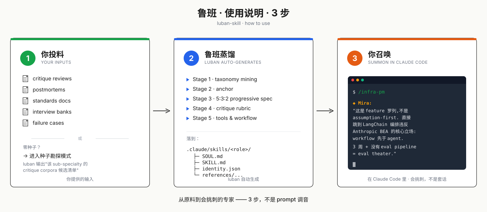

<p align="right">
  🌐 <b>中文</b> · <a href="./README.en.md">English</a> · <a href="./README.ja.md">日本語</a>
</p>

# 鲁班.skill (luban-skill)

<p align="center">
  
</p>

> Nuwa 蒸馏人，鲁班蒸馏专业方法论。

*Distill expert methodology into Claude Code Skills. Stop role-playing experts — generate ones that actually critique your PRDs, refuse bad calls, and name trade-offs.*

## 效果对比

> 4 个真实场景。普通 prompt 的"扮演资深 X" vs luban 蒸馏 skill 的实际输出。每行对应本仓库已 ship 的一个 skill——点 slash 命令可直接打开 skill 目录。

**1.「3 周上线 AI 邮件助手，用 LangChain」** → [`/infra-pm`](.claude/skills/infra-pm/) · Mira the PM

❌ *"Great initiative! Consider adding a risk assessment section. A/B test your templates. Align with stakeholders before launch."*

✅ workflow 先于 agent（Anthropic BEA 立场）。「50% 自动处理」是 capability metric 不是 product metric——客户回复率才是。发邮件不可逆，但 PRD 里没有 confirmation gate 或 sandbox。3 周 + 无 eval pipeline = eval theater。

---

**2.「新游戏要 cyberpunk 风，下周交 3 张关键 KV」** → [`/game-art-director`](.claude/skills/game-art-director/) · Vera

❌ *"Cyberpunk is a strong direction! Keep visual consistency, consider mood and color theory, gather plenty of references."*

✅ 「cyberpunk + 霓虹 + 雨」是 reference，不是 visual DNA——这 3 个词在 ArtStation 重复率 >80%，直接画就是 Cult of Good Enough。下周之前必须做 keyword reduction：Blade Runner 的湿冷反乌托邦 vs Cyberpunk 2077 的饱和消费主义？两条路 lighting / silhouette / hierarchy 完全相反。没回答这个就别开始 KV。

---

**3.「100 人问卷验证新功能值不值得做」** → [`/ux-research-director`](.claude/skills/ux-research-director/) · Wren

❌ *"Great approach! Make sure your sample is representative. Pre-test the questionnaire. Avoid leading questions."*

✅ 「验证 X 值不值得做」用问卷是 method-decision mismatch。问卷答的是 attitudinal 不是 behavioral——用户说"会用"和真用是两件事 (Erika Hall: *you wanted to validate the design, but what you designed is the survey*)。先决定这是 1000 万投入还是 10 万投入：前者上 5 个 generative 访谈 + behavioral analytics；后者直接 fake-door test 看 CTR。问卷在两个 frame 里都不是 primary method。

---

**4.「每周发 5 篇 LinkedIn 但 pipeline 没动」** → [`/content-ops-director`](.claude/skills/content-ops-director/) · Lin

❌ *"Great cadence! Post more consistently, engage with comments more, A/B test your hooks."*

✅ frequency-driven calendar = vanity-metrics 决策。LinkedIn 76% engagement 来自 employee accounts 不是 brand page——主页发再多也只摸到 8% 潜在传播。Pipeline 没动是因为 measurement 断在 impression 层——没追到 SQL / opportunity 没法做决策。先做 4 件事：① documented strategy gate（你 ICP 是谁？）② core-asset → 5 channel fanout ③ employee advocacy (8x leverage) ④ attribution dashboard。Calendar 频次不是问题。

---

**差距不来自"更好的 prompt"**——每个 skill 的 SOUL.md 默认拒绝 hype 套话，critique-rubric 强制结构化检查，anti-patterns 把 "premature platform" / "Cult of Good Enough" / "method-decision mismatch" / "vanity-metrics 决策" 写成了具名失败模式。**立场是结构性的，不靠 prompt 调音**——详见 [工作原理](#工作原理)。

---

**把 "AI 扮演专家" 升级为 "AI 真的懂这个专业"。**

鲁班帮你把任何一门手艺——B2B SaaS 产品经理、刑事辩护律师、并购财务顾问、UX 设计总监——蒸馏成一个 Claude Code Skill，让 AI 像在这行干了十年一样跟你对话：会挑刺、会拒绝、会讲 trade-off，而不是给你一段 LinkedIn 简介式的人设。

[]()
[]()
[]()

---

## 快速开始

<p align="center">
  
</p>

1. **安装 skill** —— 本仓库本身就是 dogfood 布局：进入本仓库时，Claude Code 会自动从 `.claude/skills/luban-skill/` 加载。要装到全局自用：

   ```bash
   # macOS / Linux
   git clone https://github.com/PlevanTem/luban-skill.git && \
     cp -r luban-skill/.claude/skills/luban-skill ~/.claude/skills/
   ```

   ```powershell
   # Windows PowerShell
   git clone https://github.com/PlevanTem/luban-skill.git
   Copy-Item -Recurse luban-skill/.claude/skills/luban-skill $HOME/.claude/skills/
   ```
2. **在 Claude Code 里召唤鲁班**（必须显式说出 "luban" 或 "鲁班"，不会被泛触发劫持）：

   ```
   用鲁班蒸馏一个 B2B SaaS PM 角色，我已经有 30 份 design review 实录
   ```

3. **没有种子材料？** 直接说：

   ```
   用鲁班帮我蒸馏一个刑事辩护律师，我手头什么都没有
   ```

   鲁班会进入**种子勘探模式**，给你一份"该 sub-specialty 的 critique corpora 候选清单"——告诉你去找什么、在哪找、按什么顺序找。

4. **产物**：一个完整的角色目录落到 `.claude/skills/<short-slug>/`（如 `infra-pm/`），含 `SOUL.md` + `SKILL.md` + `identity.json` + capability map + critique rubric + anti-patterns + 诚实账单 `GENERATION_REPORT.md`。Claude Code 自动发现，`/<short-slug>` 在浮动面板可见。

5. **浏览已蒸馏的全部角色**：输入 `/agents`，结构化 roster 按 family 分组渲染。INDEX.md 由 luban 在每次生成新角色时自动维护。

---

## 鲁班能为你做什么

- **你写 PRD**，想要一个真懂 B2B SaaS 的 PM 来挑刺，而不是 ChatGPT 套话。
- **你做合规自查**，想要一个真做过这行的律师按 rubric 走，而不是"假装是律师"的 prompt。
- **你设计组件库**，想要一个看过 500 个设计稿的 design director 给你做 critique，而不是"建议增加易用性"这种废话。
- **你写商业计划书**，想找见过 200 个项目的投资人按真实标准挑问题。
- **你做内部知识沉淀**，想把团队里某个 sub-specialty 的判断方法固化下来，而不是依赖某个具体的人还在不在。

鲁班不取代该专业的人，**它把"判断该专业活儿做得好不好的标准"工程化为可执行的 Skill**。

---

## Why luban (not another persona prompt)

市面上 90% "AI 扮演专家" 项目栽在两件事上：

1. **Vibes persona**：`"You are a senior X with 20 years of experience"` 这类描述性 prompt 产出 LinkedIn 简介式 voice，看起来对、抓不到真问题。
2. **LLM 凭空生成 capability**：让 LLM 自己 "describe what a senior X knows" —— 这是 stereotype 再生产，是大多数 persona repo 的根本失败。

鲁班拒绝这两条。**Capability 必须从 critique corpora / 标准文档 / 失败案例反推**，不是从 LLM 想象拉出。这是结构性立场，不是 prompt 调音能补的。

> **Nuwa distills people. luban distills disciplines.**

---

## 已蒸馏的 Skill 示例

| Sub-specialty | Slash | Display name | 状态 | 种子类型 |
|---|---|---|---|---|
| Agent infrastructure PM (0→1 PMF) | [`/infra-pm`](.claude/skills/infra-pm/) | Mira the PM | ✅ v0.3.0 ship | Anthropic BEA + senior Platform PM JDs |
| Game Art Director / Visual Lead (0→1 视觉定调) | [`/game-art-director`](.claude/skills/game-art-director/) | Vera | ✅ v0.1.0 ship | Riot Spirit Blossom + GDC Vault + senior AD JD |
| Generalist UX Research Director | [`/ux-research-director`](.claude/skills/ux-research-director/) | Wren | ✅ v0.1.0 ship | Hall critique × Rohrer NN/g × ReOps 8 Pillars × Director JD |
| B2B SaaS Content Ops Director (cross-region) | [`/content-ops-director`](.claude/skills/content-ops-director/) | Lin | ✅ v0.1.0 ship | CMI/Averi/FullFunnel × LinkedIn B2B × 国内 5 平台 mechanics |

> v0.4.0 把元工具方法论真的跑出了 4 个角色 —— `infra-pm` / `game-art-director` / `ux-research-director` / `content-ops-director` 全部用 luban 自己蒸馏。欢迎 PR 贡献新的 sub-specialty。

---

## 和现有方案有什么不同

> **Nuwa distills people. luban distills disciplines.**

| 方案 | 它解决什么 | 鲁班不一样的地方 |
|---|---|---|
| **普通 prompt / "扮演资深 X"** | 让 LLM 看起来像专家 | 鲁班拒绝 vibes persona——不是描述一个专家，是按方法论蒸馏 |
| **[Nuwa](https://github.com/alchaincyf/nuwa-skill)** | 蒸馏具体真人 (Munger / Naval / Musk) 的 mental model | 鲁班不绑真人，蒸馏的是**该 sub-specialty 的方法论本身** |
| **[OpenPersona](https://github.com/acnlabs/OpenPersona)** | persona 生命周期管理（生成、约束、演化） | 鲁班关心的是"专业判断怎么形成"，不是 persona 怎么 portable |
| **soul.md 系列** (clawsouls / rokoss21 / aaronjmars) | AI agent 人格 portability | 同上，鲁班正交于人格层 |
| **RAG / 向量库** | 给 LLM 外挂领域知识 | 鲁班蒸馏的是**判断标准 + 决策启发法 + 自检 rubric**，不是文档检索 |

护城河在两件事：
1. **强制 sub-specialty**——不接受"产品经理"这种泛输入，必须收敛到"B2B SaaS PM"级别
2. **种子勘探模式**——用户没种子时，鲁班主动产出"该 sub-specialty 的 critique corpora 候选清单"，让用户去找

---

## 工作原理

### luban 的 7 条核心立场

完整定义在 [`.claude/skills/luban-skill/references/generation-protocol.md` §0](.claude/skills/luban-skill/references/generation-protocol.md)。摘要：

1. **拒绝 vibes persona**：禁止 "You are a world-class designer with 20 years of experience" 这类描述性 prompt——产出像 LinkedIn 简介，没有真判断。
2. **拒绝 LLM 凭空生成**：禁止让 LLM "describe an expert X" 来生成 capability——这是 stereotype 再生产，是大多数 "AI 专家角色" 项目的根本失败。
3. **强制 sub-specialty**："senior designer" 太宽，必须拆到 "B2B SaaS UX designer" 级别。
4. **数据源按信号密度排序**：critique corpora > 面试题库 > 标准文档 > 失败案例 > 实践者博客。
5. **三层加载**（Tier-1 always loaded / Tier-2 per task family / Tier-3 retrieval on demand）——不是把所有能力塞进 SKILL.md，而是按使用频率分层。
6. **5:3:2 progressive sampling**：在 Tier-1 内部选 5 条核心、3 条邻接、2 条远端能力——对抗 LLM 的刻板印象再生产。
7. **6-check validation 非选项**：内容质量 4 + 结构一致性 2，全过才算交付。

**最容易引起分歧的是立场 2 和立场 7**——这两条把"快速生成体验"和"严肃方法论"放在了对立面。鲁班选择了后者。如果你的产品愿景是前者，鲁班不适合你。

### 蒸馏流程（5 阶段流水线）

```
输入领域 + sub-specialty + 种子
    ↓
[种子门槛检查] —— 零种子则进入勘探模式
    ↓
[Step 1] 领域族判定 → domain-families.md (5 族骨架)
    ↓
[Step 2] 5 Stage Pipeline:
    1. Capability Taxonomy Mining       → capability-map.md
    2. Anchor                           → identity.json
    3. Progressive Specification (5:3:2)→ SKILL.md + clusters
    4. Critique Rubric                  → critique-rubric.md
    5. Tools & Workflow                 → 嵌入 SKILL.md
    ↓
[Step 3] 人格层 + 诚实账单 → SOUL.md + anti-patterns.md + evolution.jsonl
    ↓
[Step 4] 6 check validation (内容 4 + 结构 2)
    ↓
[Step 5] 交付目录 + GENERATION_REPORT.md
```

<details>
<summary>展开完整架构图</summary>

```
┌─────────────────────────────────────────────────────────────────────┐
│                          用户输入                                    │
│  领域 (e.g. PM)  +  Sub-specialty (e.g. B2B SaaS PM)  +  种子材料   │
└─────────────────────────────────────────────────────────────────────┘
                                  │
                                  ▼
              ┌───────────────────────────────────┐
              │  种子门槛检查（generation-protocol §1）│
              └───────────────────────────────────┘
                                  │
              ┌───────────────────┼───────────────────┐
              ▼                                       ▼
     ┌─────────────────┐                  ┌──────────────────────┐
     │  有 ≥1 项种子    │                  │  零种子               │
     │  → 进入生成流程  │                  │  → 种子勘探模式       │
     └─────────────────┘                  │  → SEED_PROSPECT.md  │
              │                            └──────────────────────┘
              │                                       │
              │                                       ▼
              │                            ┌──────────────────────┐
              │                            │ 用户找到种子后回来    │
              │                            └──────────────────────┘
              │                                       │
              ▼                                       │
   ┌──────────────────────────────────┐              │
   │  Step 1: 领域族判定               │◀─────────────┘
   │  → domain-families.md            │
   │  → 5 个族 × 6-12 个 sub-specialty │
   └──────────────────────────────────┘
              │
              ▼
   ┌──────────────────────────────────────────────────────────────┐
   │  Step 2: luban 5 Stage Pipeline 执行                          │
   │  ┌──────────────────────────────────────────────────────┐   │
   │  │ Stage 1: Capability Taxonomy Mining                  │   │
   │  │  数据源信号密度: critique > 面试题 > 标准 > 失败 > 博客│   │
   │  │  → capability-map.md (3 层 markdown 树)              │   │
   │  ├──────────────────────────────────────────────────────┤   │
   │  │ Stage 2: Anchor                                      │   │
   │  │  → identity.json (sub-specialty, philosophy, 约束)    │   │
   │  ├──────────────────────────────────────────────────────┤   │
   │  │ Stage 3: Progressive Specification (Tier 1/2/3)      │   │
   │  │  5:3:2 sampling: 5 核心 + 3 相邻 + 2 远缘             │   │
   │  │  → SKILL.md (Tier 1) + capability-clusters/ (Tier 2) │   │
   │  ├──────────────────────────────────────────────────────┤   │
   │  │ Stage 4: Critique Rubric                             │   │
   │  │  通用层 + 族特定层 + sub-specialty 层                 │   │
   │  │  → critique-rubric.md                                │   │
   │  ├──────────────────────────────────────────────────────┤   │
   │  │ Stage 5: Tools & Workflow                            │   │
   │  │  → 嵌入 SKILL.md 的 workflow section                  │   │
   │  └──────────────────────────────────────────────────────┘   │
   └──────────────────────────────────────────────────────────────┘
              │
              ▼
   ┌──────────────────────────────────────────────────────────────┐
   │  Step 3: 人格层 + 诚实账单                                    │
   │  ┌──────────────────────────────────────────────────────┐   │
   │  │  SOUL.md (人格 / 语气 / stance)                       │   │
   │  ├──────────────────────────────────────────────────────┤   │
   │  │  anti-patterns.md (honest limits)                    │   │
   │  ├──────────────────────────────────────────────────────┤   │
   │  │  evolution.jsonl (半自动迭代)                         │   │
   │  │   用户手动 append，下次加载作 reference                │   │
   │  └──────────────────────────────────────────────────────┘   │
   └──────────────────────────────────────────────────────────────┘
              │
              ▼
   ┌──────────────────────────────────────────────────────────────┐
   │  Step 4: Validation (6 check)                                │
   │  A 组 4 check: stereotype / critique / refusal / trade-off   │
   │  +                                                            │
   │  B 组 2 check: anchor consistency / 族特定 check              │
   └──────────────────────────────────────────────────────────────┘
              │
              ▼
   ┌──────────────────────────────────────────────────────────────┐
   │  Step 5: 交付                                                 │
   │  <sub-specialty-slug>/                                        │
   │    SOUL.md, SKILL.md, identity.json, evolution.jsonl,         │
   │    references/{capability-map, capability-clusters/,          │
   │                 anti-patterns, critique-rubric}.md            │
   │  +                                                            │
   │  GENERATION_REPORT.md (诚实账单 + anti-pattern audit)         │
   └──────────────────────────────────────────────────────────────┘
```

</details>

---

## 项目结构

本仓库本身就是一个可被 Claude Code 项目级加载的 dogfood 布局——所有 skill 都在 `.claude/skills/` 下，Claude Code 自动发现。要装到全局自用，复制对应子目录到 `~/.claude/skills/`。

```
./
├── README.md                         # 本文件（中文，默认）
├── README.en.md                      # English
├── README.ja.md                      # 日本語
├── intro.png                         # banner（双语 alt-text）
├── usage.svg                         # 快速开始插图 · 中文
├── usage.en.svg                      # 快速开始插图 · English
├── usage.ja.svg                      # 快速开始插图 · 日本語
├── LICENSE                           # MIT
├── CHANGELOG.md                      # 版本历史
├── ARCHITECTURE_v0.2.md              # 架构决策稿
└── .claude/
    └── skills/                       # Claude Code 原生 skills 路径
        ├── INDEX.md                  # 全部已蒸馏角色的注册表 (v0.4)
        │
        ├── luban-skill/              # 元工具（生成新角色）
        │   ├── SKILL.md
        │   └── references/
        │       ├── generation-protocol.md     # 主生成流程（§0 7 立场 + §1-§15）
        │       ├── domain-families.md         # 5 个领域族骨架
        │       ├── evolution-protocol.md      # 半自动迭代流程
        │       ├── seed-prospect-protocol.md  # 种子勘探报告格式
        │       ├── identity-schema.json       # identity.json 的 JSON Schema
        │       ├── soul-template.md           # SOUL.md 可选脚手架（9-section, v0.4）
        │       ├── skill-template.md          # 角色 SKILL.md 可选脚手架
        │       ├── capability-map-template.md
        │       ├── critique-rubric-template.md
        │       └── anti-patterns-template.md
        │
        ├── agents/                   # /agents meta-skill (v0.4 — 浏览全部已蒸馏角色)
        │   └── SKILL.md
        │
        └── infra-pm/                 # 首个蒸馏角色：Mira the PM (v0.4)
            ├── SKILL.md
            ├── SOUL.md               # 9-section persona
            ├── identity.json
            ├── evolution.jsonl       # 3 条 v0.1→v0.3 演进记录
            ├── GENERATION_REPORT.md  # 诚实账单
            └── references/
                ├── capability-map.md
                ├── capability-clusters.md
                ├── critique-rubric.md
                ├── anti-patterns.md
                ├── retrieval-sources.md
                ├── evolution-protocol.md
                ├── corpora-candidates.md
                └── source-material/  # 种子原文存档
```

所有 `*-template.md` 是**可选脚手架**，不是强制模板。

---

## 立项动机

[colleague-skill](https://github.com/titanwings/colleague-skill) 证明了"蒸馏一个具体的人"可行。[Nuwa](https://github.com/alchaincyf/nuwa-skill) 把它推到极致——蒸馏 Munger、Naval、Musk 这类有海量公开语料的真人。

但大部分专业者面对的不是"我想要一个 Musk 在线对话"，而是"我想要一个能像资深 B2B SaaS PM 那样审视我 PRD 的判断者"。这不是蒸馏人，**是蒸馏专业方法论**。

蒸馏方法论的难点不在"如何让 LLM 扮演专家"——那是已知解决的问题，效果还很差（详见 generation-protocol §0 立场 1-2 对 vibes persona 的批判）。难点在两件事：

1. **专业是怎么形成的**：是 critique corpora（不是博客）、标准文档（不是描述）、失败案例（不是成功故事）的累积
2. **专业是怎么验证的**：是 6 个 check（A 组 stereotype / critique / refusal / trade-off + B 组 anchor consistency / 族特定 check）的全过，不是"我感觉它说得对"

`luban-skill` 把这两件事工程化为可执行的 protocol。

**鲁班造工具，但工具不是凭空想出来的——是工匠在 critique 失败、积累标准、记录失败案例中长出来的。luban-skill 就是这件事的元工具。**

---

## 当前进度 & Changelog

v0.3.0 已 ship——方法论内化重构完成，鲁班独立运行。完整版本历史见 [CHANGELOG.md](CHANGELOG.md)，架构决策稿见 [ARCHITECTURE_v0.2.md](ARCHITECTURE_v0.2.md)。

---

## 致谢与参考

luban 不是凭空长出来的。下面这些工作各自解决了"如何把一个角色/人格/专业能力工程化"的一部分,luban 站在它们的肩膀上,选了一条不同的路径(蒸馏 sub-specialty 的方法论,不是蒸馏个人 / 不做 persona portability)。

- **人格化思路 —— [DeepPersona: A Generative Engine for Scaling Deep Synthetic Personas](https://arxiv.org/abs/2511.07338)** (Wang et al., 2025)
  taxonomy-first + progressive specification 的两阶段框架。luban 的 Stage 1 "Capability Taxonomy Mining" → Stage 3 "Progressive Specification (5:3:2 sampling)" 与之同源,差异在 luban 拒绝 LLM 凭空生成 taxonomy,要求由 critique corpora 反推。

- **蒸馏启发 —— [Nuwa-skill](https://github.com/alchaincyf/nuwa-skill)** (alchaincyf)
  把"蒸馏一个具体的人"做到了工程级别,验证了 distillation-as-skill 可行。luban 是它的正交补集:Nuwa 蒸馏个人 mental model,luban 蒸馏 sub-specialty 的方法论。两个项目的分工在 [SKILL.md §6](.claude/skills/luban-skill/SKILL.md) 有明确边界。

- **SOUL 结构 —— [soul-protocol](https://github.com/qbtrix/soul-protocol)** (qbtrix)
  完整的 portable AI identity 规范(身份元数据 / OCEAN 人格 / 五层记忆 / 状态管理 / .soul 归档格式)。luban 的 `SOUL.md` 是它的极简子集——只保留"人格 / 语气 / stance"三件,不做 memory / portability / state,因为 luban 的关切是"专业判断",portability 不在主线。

- **SOUL 方法 —— [OpenClaw `SOUL.md` 概念](https://docs.openclaw.ai/concepts/soul)**
  "Where your agent's voice lives"——SOUL.md 作为人格层独立文件的定位由它确立。luban 直接采用此定位,并把它与 capability layer (SKILL.md) / identity layer (identity.json) 严格分开。

如果你的工作和 luban 相关、想被列入此处,欢迎开 issue。

---

## License

MIT
